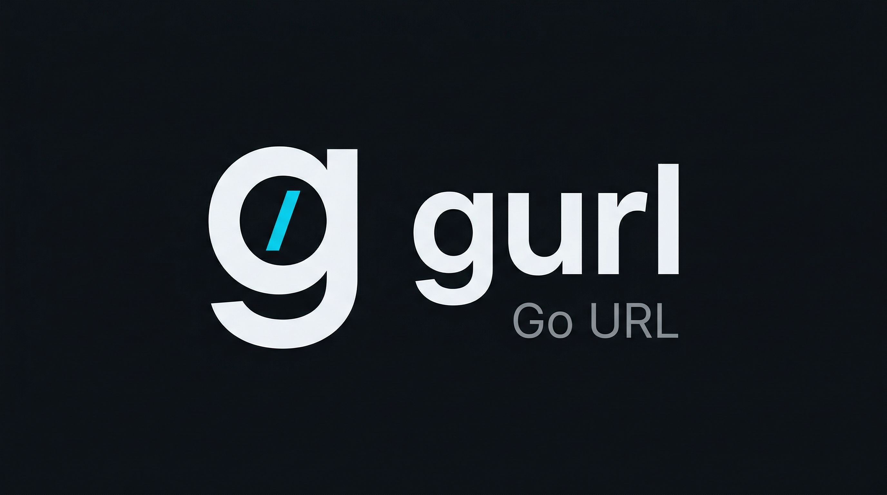

# gurl

[](https://github.com/bsreeram08/gurl/releases/latest)
[](https://go.dev)
[](LICENSE)



A CLI API workbench. Save requests, run them with environments, assert on responses, generate client code. All from the terminal.

Not a curl wrapper. gurl persists requests, manages collections and environments, runs JavaScript hooks, and speaks HTTP, GraphQL, gRPC, WebSocket, and SSE.

> **Status: early (v0.3.x).** The CLI works. The TUI (`gurl tui`) exists in code but is not functional yet. Everything below describes the CLI interface.

## Features

- **Named requests** — save any curl command with a name, replay it forever
- **Variable templates** — `{{token}}`, `{{BASE_URL}}`, substituted at runtime with `--var` or environments
- **Environments** — swap base URLs, secrets, and tokens between dev/staging/prod
- **Import** — OpenAPI, Insomnia, Bruno, Postman, HAR
- **Auth handlers** — Basic, Bearer, API Key, Digest, OAuth 1/2, AWS SigV4, NTLM — saved with requests, template-aware
- **Protocols** — HTTP, GraphQL, gRPC, WebSocket, SSE
- **Scripting** — JavaScript pre/post-request hooks (goja runtime)
- **Assertions** — assert on status, headers, body, jsonpath, regex, and extracted variables
- **Request chaining** — `setNextRequest`, `run-if`, extracted variables flow between requests
- **Collection runner** — data-driven testing with CSV/JSON, dry runs, assertion bail mode
- **Code generation** — curl, Go, Python, JavaScript from any saved request
- **Execution history** — per-request history, global timeline, diff between runs
- **Plugin system** — middleware, output formatters, commands, and auth handlers

### Known limitations

- The TUI is not functional. Use the CLI commands below.
- Collection-level auth inheritance is defined but not wired into the execution path yet.

## Installation

### Homebrew (macOS / Linux)

```bash
brew tap bsreeram08/gurl https://github.com/bsreeram08/gurl
brew install gurl
```

### One-liner

```bash
curl -sL https://raw.githubusercontent.com/bsreeram08/gurl/master/scripts/install.sh | bash
```

### Pre-built Binaries

Download from [GitHub Releases](https://github.com/bsreeram08/gurl/releases/latest):

```bash
# macOS (Apple Silicon)
curl -LO https://github.com/bsreeram08/gurl/releases/latest/download/gurl-darwin-arm64.tar.gz
tar -xzf gurl-darwin-arm64.tar.gz && sudo mv gurl /usr/local/bin/gurl

# Linux (amd64)
curl -LO https://github.com/bsreeram08/gurl/releases/latest/download/gurl-linux-amd64.tar.gz
tar -xzf gurl-linux-amd64.tar.gz && sudo mv gurl /usr/local/bin/gurl

# Linux (arm64)
curl -LO https://github.com/bsreeram08/gurl/releases/latest/download/gurl-linux-arm64.tar.gz
tar -xzf gurl-linux-arm64.tar.gz && sudo mv gurl /usr/local/bin/gurl
```

### Build from Source

```bash
git clone https://github.com/bsreeram08/gurl.git
cd gurl
go build -o gurl ./cmd/gurl
sudo mv gurl /usr/local/bin/
gurl --version
```

## Quick Start

```bash
# Save a request
gurl save "health" https://api.example.com/health

# Save with full curl flags
gurl save "create-order" https://api.example.com/orders \
  -X POST \
  -H "Content-Type: application/json" \
  -H "Authorization: Bearer {{token}}" \
  -d '{"customer_id": "{{customerId}}"}'

# Or pipe a raw curl string
echo 'curl -X POST https://api.example.com/orders -d "{}"' | gurl save "create-order"

# Run it
gurl run "create-order" --var token=abc123 --var customerId=42

# List all saved requests
gurl list
```

## Real Workflows

### Migrate from Postman, keep your terminal

```bash
# Import your existing collection
gurl import postman ./my-collection.json

# Everything is here — names, auth, variables
gurl list
gurl run "Get Users" --env staging
```

### Test APIs with scripting and assertions

```bash
# Save extraction and scripts on a request
gurl save "login" https://api.example.com/auth/login \
  -X POST \
  --extract token=jsonpath:$.token \
  --post-script "gurl.setNextRequest('profile')"

# Run the chain, then persist extracted/script variables to the environment
gurl run "login" --env dev --chain --persist --assert "extract:token != ''"
```

### Save authentication with the request

```bash
# Discover the handlers and their parameters
gurl auth list
gurl auth info bearer

# Save a bearer token once, then run the request later
gurl save "profile" https://api.example.com/me \
  --auth bearer \
  --auth-param token='{{token}}'

gurl run "profile" --var token=abc123

# Basic auth and API keys work the same way
gurl save "admin" https://api.example.com/admin \
  --auth basic \
  --auth-param username='{{user}}' \
  --auth-param password='{{password}}'

gurl save "search" https://api.example.com/search \
  --auth apikey \
  --auth-param header=X-API-Key \
  --auth-param value='{{api_key}}'
```

Auth parameters use repeated `--auth-param key=value` flags. Saved auth settings are applied when you run the request, after variable templates are substituted.

### Run collections with data-driven inputs

```bash
# Run every request in a collection with CSV test data
gurl collection run "checkout-flow" --data ./test-data.csv --env staging

# Preview the flow without sending requests
gurl collection run "checkout-flow" --env staging --dry-run

# Stop only when an assertion fails
gurl collection run "checkout-flow" --env staging --assert-bail
```

### Compare responses over time

```bash
# See what changed between the last two runs
gurl diff "get-user"

# Or browse the full timeline
gurl timeline --pattern "get-*"
```

### Generate client code from saved requests

```bash
gurl codegen "create-order" --lang python
gurl codegen "create-order" --lang javascript
gurl codegen "create-order" --lang go
gurl codegen "create-order" --lang curl
```

## All Commands

| Command | Description |
|---------|-------------|
| `save` | Save a request (flags or raw curl string) |
| `run` | Execute a saved request with variable substitution |
| `list` | List saved requests (filter by collection, tag, pattern) |
| `auth` | Discover supported authentication types and parameters |
| `detect` | Parse curl from stdin |
| `edit` | Edit a saved request |
| `delete` | Delete a saved request |
| `rename` | Rename a saved request |
| `show` | Show full request details |
| `history` | Show execution history for a request |
| `timeline` | Global execution timeline across all requests |
| `diff` | Compare last two responses for a request |
| `env` | Manage environments (create, list, show, switch) |
| `collection` | Manage collections |
| `sequence` | Run multiple requests in sequence |
| `graphql` | Execute a GraphQL query |
| `export` | Export requests to JSON |
| `import` | Import from OpenAPI/Insomnia/Bruno/Postman/HAR |
| `paste` | Copy request as curl command to clipboard |
| `codegen` | Generate code (curl, Go, Python, JavaScript) |
| `tui` | Launch interactive TUI (not functional yet) |
| `update` | Self-update to latest release |

## Environments

```bash
# Create environments
gurl env create dev --var "BASE_URL=https://dev.api.com" --secret "API_KEY=sk-dev-123"
gurl env create prod --var "BASE_URL=https://api.com" --secret "API_KEY=sk-prod-456"

# Run with an environment
gurl run "create-order" --env prod

# Switch default environment
gurl env use dev
```

Secrets are encrypted at rest with AES-256-GCM and never appear in logs or generated code.

## Configuration

`~/.config/gurl/config.toml` or `~/.gurlrc`:

```toml
[general]
history_depth = 100
auto_template = true
timeout = "30s"

[output]
default_format = "auto"
syntax_highlight = true
json_pretty = true
```

## Contributing

See [CONTRIBUTING.md](CONTRIBUTING.md).

## License

MIT
